<!--- Copyright (c) 2017 Gordon Williams, Pur3 Ltd. See the file LICENSE for copying permission. -->
Stream from Puck.js to AWS IOT Core & SNS Email
=========================

<span style="color:red">:warning: **Please view the correctly rendered version of this page at https://www.espruino.com/Puck.js+AWS+IOT. Links, lists, videos, search, and other features will not work correctly when viewed on GitHub** :warning:</span>

* KEYWORDS: Tutorials,Puck.js,BLE,Bluetooth,Magnetic,AWS,Amazon Web Services,IOT Core,SNS
* USES: Puck.js,BLE,Only BLE

This tutorial shows you how use [Puck.js](/Puck.js) and a Raspberry Pi to stream data to AWS.

[[https://youtu.be/Ejb9RpYWCKc]]

The AWS Tutorial (Door Alarm SNS Email):

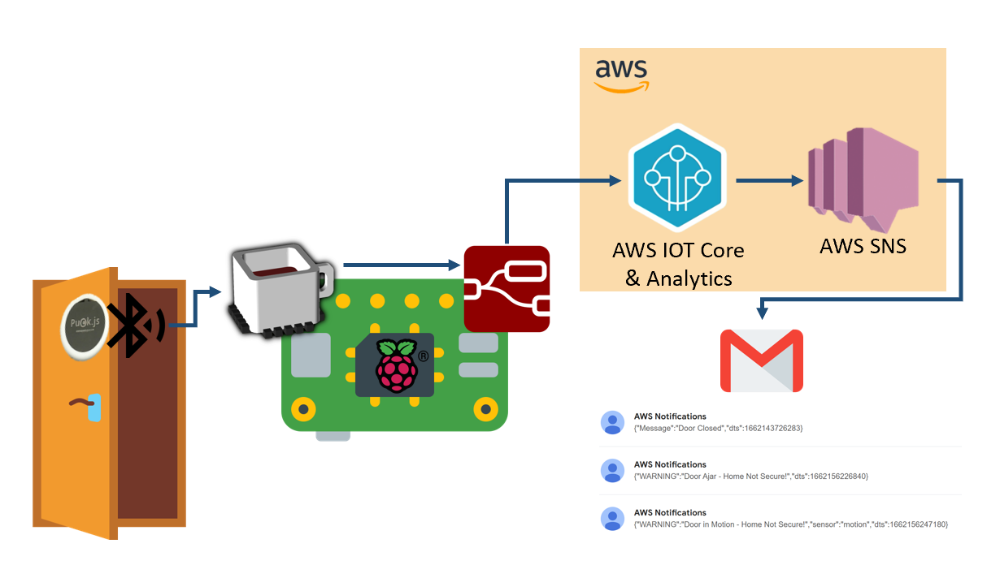

- The puck.js app advertises movement/magnetic field fluctuations (and other info) to the Raspberry Pi EspruinoHub MQTT broker
- NodeRed ingests the MQTT message & cleans it up with a function
- A AWS IOT Core Rule publishes a message to an SNS Topic
- The SNS topic accepts the message & relays it to the subscribers
- An SNS subscription sends the message as an email to a subscriber
- Subscriber receives an email on their phone letting them know their door is open/closed or the "security system" is armed/disarmed

Prerequesites
--------
* A [Puck.js](/Puck.js) device (or other [Espruino board](/Order) if you don't need Bluetooth LE
* A Magnet & Command Strips to hold Magnet & Puck.js to Door & Door Frame
* Raspberry Pi with Bluettoth/Wifi Capabilities and NodeRed & EspruinoHub installed on it
* Install [Espruino Hub](https://github.com/espruino/EspruinoHub) & [NodeRed](https://www.espruino.com/BLE+Node-RED) on the Raspberry Pi
* Set EspruinoHub & NodeRed to auto start on a reboot
* A AWS Account (This is free to set up & this project can be run for pennies a month or entirely for free)

Raspberry Pi Setup
--------

**Note: This tutorial assumes you have EspruinoHub & NodeRed installed on your Raspberry Pi already!**

#### Edit the Raspberry Pi so EspruinoHub will ingest the MQTT messages

* SSH into the Raspberry Pi and edit the attribute.js file in the EspruinoHub. This code will create a filterable channel on the MQTT broker.

Go into the attributes.js file

```
cd
cd EspruinoHub/lib
nano attributes.js
```

* Edit the exports.names dictionary in the attributes.js file, adding the code between the "Add These" Comments.
    * This adds an MQTT channel for Voltage, Light, Acceleration, Gyro, Movement, Magnetic Field info, Button Presses, LED states, NFC info and bluetooth info. The Puck will advertise info to the Raspberry Pi on these channels. Only one of these channels will be used for this project, but adding these in allows us to advertise the other sensor states in a later builds.

```
exports.names = {
  // https://www.bluetooth.com/specifications/gatt/services/
  "1801": "Generic Attribute",
  "1809": "Temperature",
  "180a": "Device Information",
  "180f": "Battery Service",
  //////////////////////////////
  // Add These /////////////////
  //////////////////////////////
  "182a": "VoltageSensor",
  "182b": "LightSensor",
  "182c": "AccelerationSensor",
  "182d": "GyroscopicSensor",
  "182e": "MovementSensor",
  "182f": "TiltDetection",
  "183a": "MagneticField",
  "183b": "MagneticFieldData",
  "183c": "ButtonPress",
  "183d": "LEDState",
  "183e": "NFCDetection",
  "183f": "NFCData",
  "184a": "BluetoothScanData",
  "184b": "BluetoothScanState",
  //////////////////////////////
  //////////////////////////////
  //////////////////////////////
  // https://github.com/atc1441/ATC_MiThermometer#advertising-format-of-the-custom-fir>
  "181a": "ATC_MiThermometer",
  "181b": "Body Composition",
  "181c": "User Data",
  "181d": "Weight Scale",
  // https://www.bluetooth.com/specifications/gatt/characteristics/
  "2a2b": "Current Time",
  "2a6d": "Pressure",
  "2a6e": "Temperature",
  "2a6f": "Humidity",
  "2af2": "Energy",
  // https://www.bluetooth.com/specifications/assigned-numbers/16-bit-uuids-for-member>
  "fe0f": "Philips",
  "fe95": "Xiaomi",
  "fe9f": "Google",
  "feaa": "Google Eddystone",

  "6e400001b5a3f393e0a9e50e24dcca9e": "nus",
  "6e400002b5a3f393e0a9e50e24dcca9e": "nus_tx",
  "6e400003b5a3f393e0a9e50e24dcca9e": "nus_rx"
};
```

* Reload the systemctl daemon

```
systemctl daemon-reload
```


Flash the Code to Puck.js
--------
* What the Code Does
    * As long as the button state remains 1, every minute, your Puck.js will advertise the temperature (f), battery level, voltage, light, and LED states. It also will advertise when it senses movement, a change in magnetic field, NFC field, or a button press. For this tutorial, we'll just be using the temperature advertisements. Upload the code to the Puck.js's flash, so it'll still be there if you swap out the battery.
* Testing the Code in [Espruino Web IDE](https://www.espruino.com/ide/)
    * 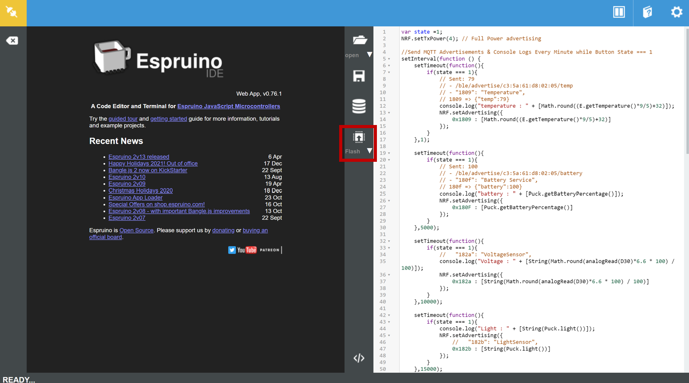
    * Check that the code is running by reading the console log output. Make surethat temperature data is coming across. Sometimes temperature data doesn't advertise if the temperature hasn't changed. If you want to test the temperature advertisement, warm up or cool down the puck temp sensor by transferring heat with your hand.
* Start Advertising!    
    * To get the data to stop showing up in the console & start advertising, take the battey out & put it back in. As long as the code was uploaded to the device's flash, it'll start advertising when the battery is put back in. The temperature data won't start sending over until one minute has gone by. Then it'll advertise the temp every minute.

```
var state =1;
NRF.setTxPower(4); // Full Power advertising

//Send MQTT Advertisements & Console Logs Every Minute while Button State === 1
setInterval(function () {
    setTimeout(function(){
        if(state === 1){
            // Sent: 79
            // - /ble/advertise/c3:5a:61:d8:02:05/temp
            // - "1809": "Temperature",
            // 1809 => {"temp":79}
            console.log("temperature : " + [Math.round((E.getTemperature()*9/5)+32)]);
            NRF.setAdvertising({
                0x1809 : [Math.round((E.getTemperature()*9/5)+32)]
            });
        }
    },1);

    setTimeout(function(){
        if(state === 1){
            // Sent: 100
            // - /ble/advertise/c3:5a:61:d8:02:05/battery
            // - "180f": "Battery Service",
            // 180f => {"battery":100}
            console.log("battery : " + [Puck.getBatteryPercentage()]);
            NRF.setAdvertising({
                0x180F : [Puck.getBatteryPercentage()]
            });
        }
    },5000);

    setTimeout(function(){
        if(state === 1){
            //   "182a": "VoltageSensor",
            console.log("Voltage : " + [String(Math.round(analogRead(D30)*6.6 * 100) / 100)]);
            NRF.setAdvertising({
                0x182a : [String(Math.round(analogRead(D30)*6.6 * 100) / 100)]
            });
        }
    },10000);

    setTimeout(function(){
        if(state === 1){
            console.log("Light : " + [String(Puck.light())]);
            NRF.setAdvertising({
                //   "182b": "LightSensor",
                0x182b : [String(Puck.light())]
            });
        }
    },15000);

    setTimeout(function(){
        if(state === 1){
            console.log("LEDs: " + [[digitalRead(LED1).toString(16)], [digitalRead(LED2).toString(16)], [digitalRead(LED2).toString(16)]]);
            NRF.setAdvertising({
                //   "183d": "LEDState",
                0x183d : [[digitalRead(LED1).toString(16)], [digitalRead(LED2).toString(16)], [digitalRead(LED2).toString(16)]]
            });
        }
    },20000);
},60000);

//Button Press
//Turn Off/On MQTT Advertising
var pressCount = 0;
setWatch(function() {
    pressCount++;
    state = (pressCount+1)%2;
    if ((pressCount+1)%2) digitalPulse(LED3,1,1500); //long flash blue light
    else
        digitalPulse(LED3,1,100); //short flash blue light
    console.log('button_press_count : [' + pressCount + ']');
    console.log('button_state : [' + (pressCount+1) + ']');
    console.log('state: ' + state);
    NRF.setAdvertising({
        0xFFFF : [pressCount],
        0x183c: [((pressCount+1)%2)],
    });
}, BTN, { edge:"rising", repeat:true, debounce:50 });

//Movement Sensor
require("puckjsv2-accel-movement").on();
var idleTimeout;
Puck.on('accel',function(a) {
    digitalWrite(LED1,1); //turn on red light
  if (idleTimeout) clearTimeout(idleTimeout);
  else
    if (state === 1) {
        console.log('movement : 1');
        NRF.setAdvertising({
            0x182e: [1],
        });
    }
    idleTimeout = setTimeout(function() {
        idleTimeout = undefined;
        digitalWrite(LED1,0);//turn off red light
        if (state === 1) {
            console.log('movement : 0');
            NRF.setAdvertising({
                0x182e: [0],
            });
        }
    },500);  
});

//Magnetic Field Sensor
require("puckjsv2-mag-level").on();
Puck.on('field',function(m) {
    digitalPulse(LED2, 1, 200);//flash green light
    if (state === 1) {
        console.log('magnetic_field : [' + m.state + ']');
        NRF.setAdvertising({
            0x183a: [m.state],
        });
    }
});

//NFC Detection
NRF.nfcURL("http://espruino.com");
NRF.on('NFCon', function() {
    digitalPulse(LED2, 1, 500);//flash on green light
    console.log('nfc_field : [1]');
    NRF.setAdvertising({
        0x183e: [1],
    });
});
NRF.on('NFCoff', function() {
    digitalPulse(LED2, 1, 200);//flash on green light
    console.log('nfc_field : [0]');
    NRF.setAdvertising({
        0x183e: [0],
    });
});
```

Setting up AWS IOT Core & SNS Topic/Subscription
--------
* Go to your AWS Console
* Open the IOT Core Service & Create a Thing
    * Manage --> Devices --> Things --> Create Thing
        * 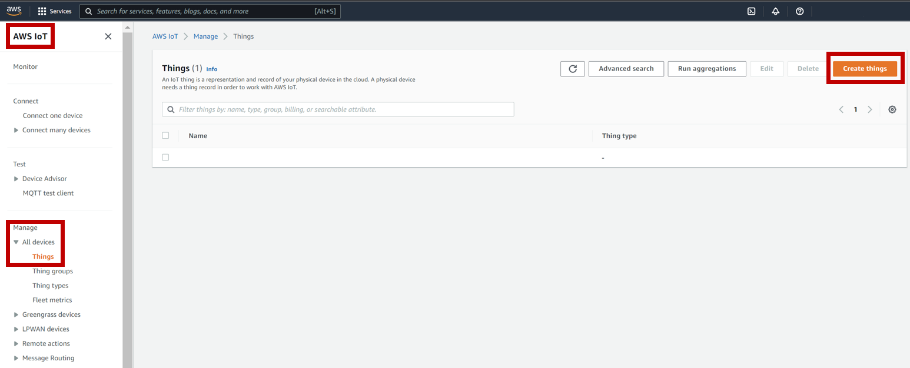
    * Name your device & click next
        * 
    * Click "Auto-generate a new certificate" and click next
        * 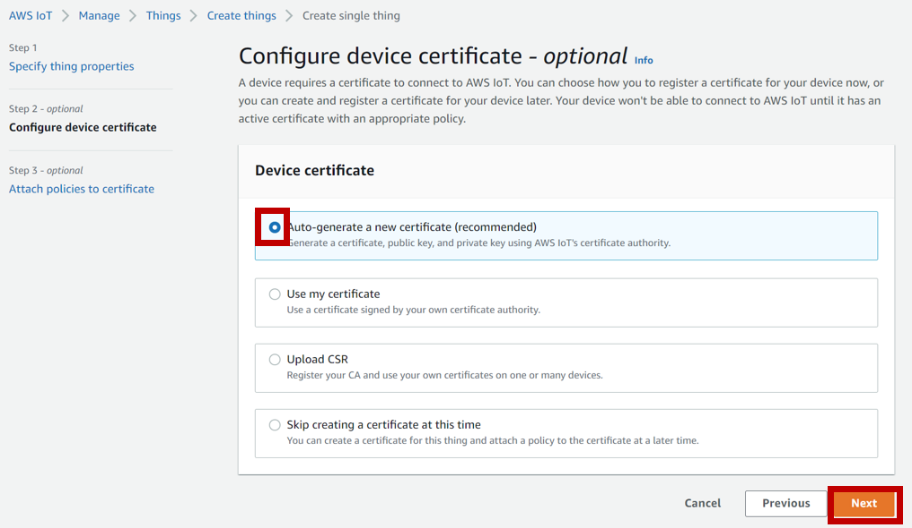
    * Click "Create Policy"
        * 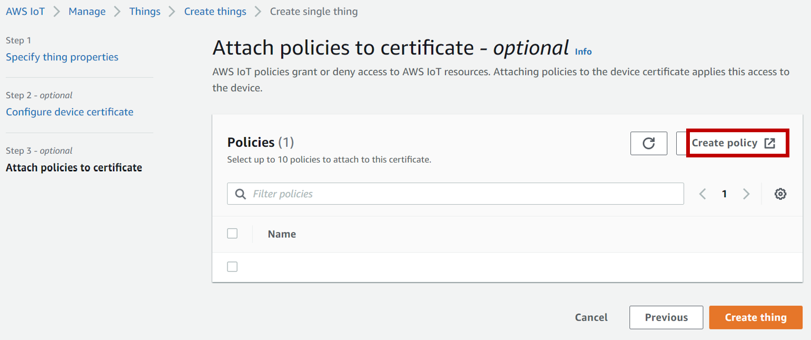
    * Name the policy & allow all for policy action & policy source. Click Create
        * 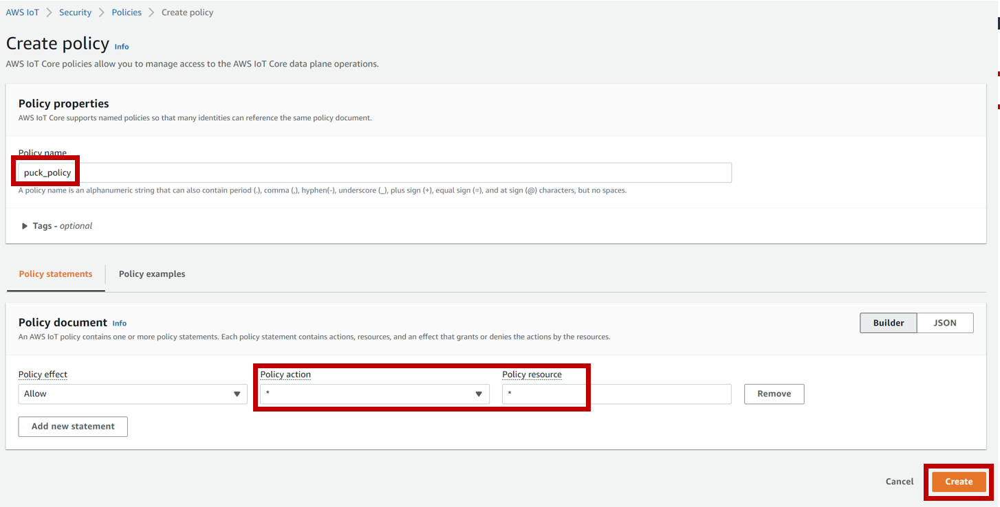
    * Choose the new polcy you just created & click "Create Thing"
        * 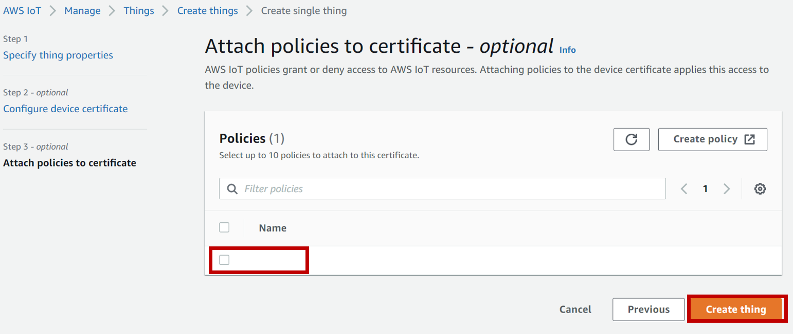
    * Optn the thing you just created and create/download certificates
        * 

* Create a Pub/Sub Topic
    * Manage --> Message Routing --> Rules --> Create Rule
        * 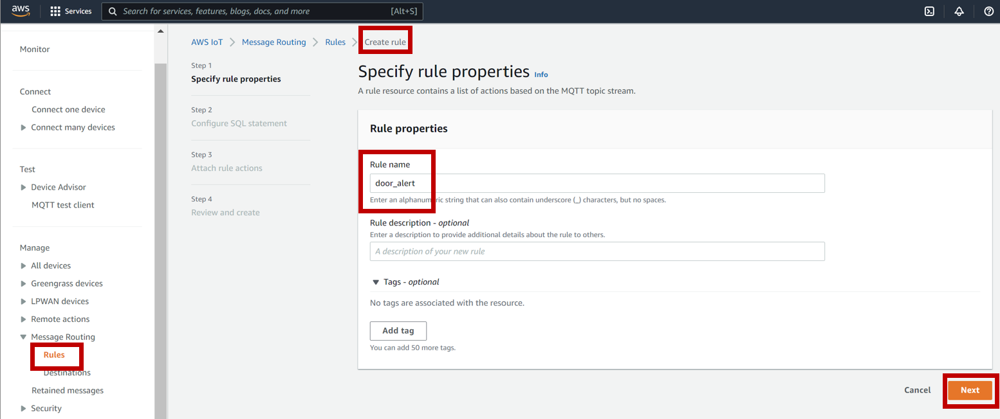
    * Paste the SQL in & click next. This allows the rule to fire when AWS IOT Core receives a MQTT message with this topic.
        * 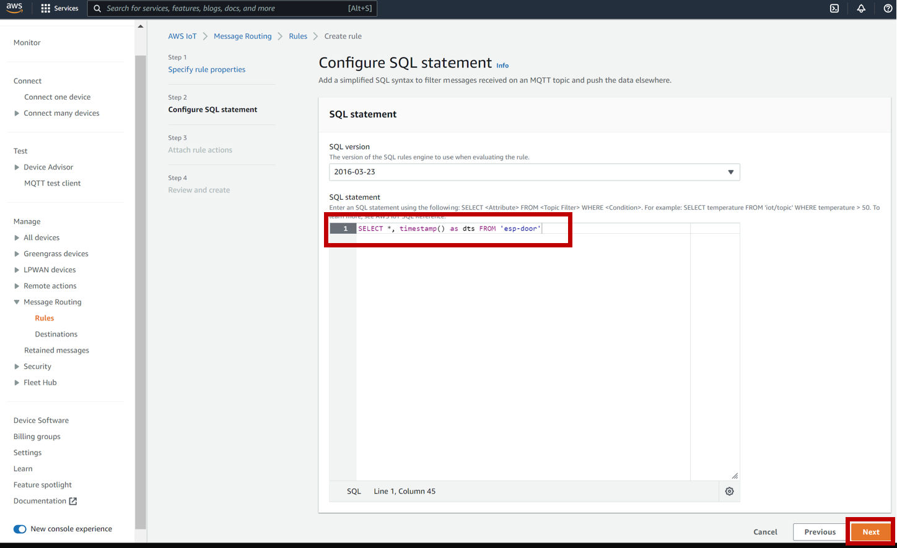

    ```
    SELECT *,  timestamp() as dts FROM 'esp_door'
    ```

    * Click Create SNS Topic
        * 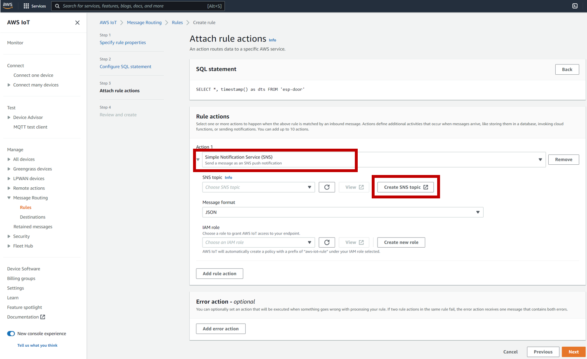
    * Create SNS Topic with a standard type and click next
        * 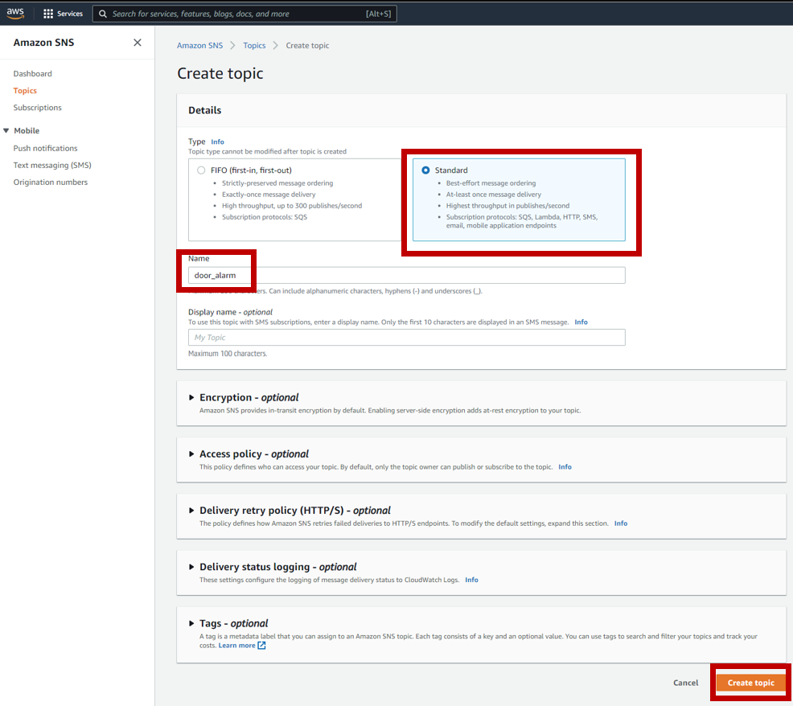
    * Go back to the other page & find the topic you just created (may need to click refresh). Create & name a new rule. Click Next.
        * 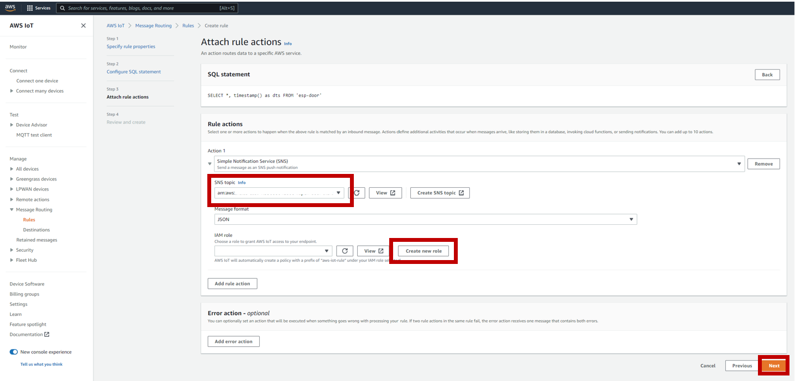
    * Now we have a SNS topic being published to, we need to create a SNS subscription that sends an email to yout email address.  
        * 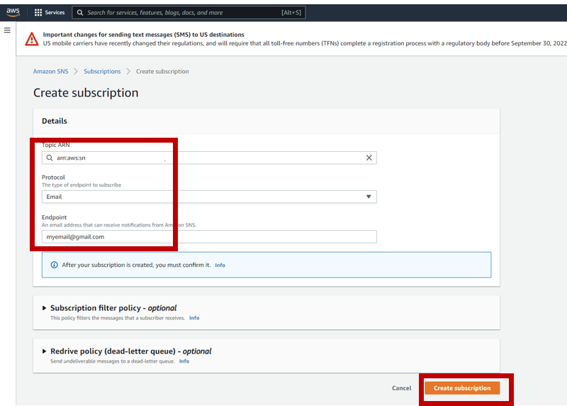

Setting up NodeRed
--------
* 
* Add a MQTT In Node that listens for the button press data.
    * 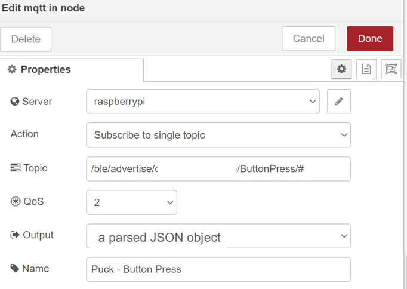
* Add a MQTT In Node that listens for the magnetic field data
    * 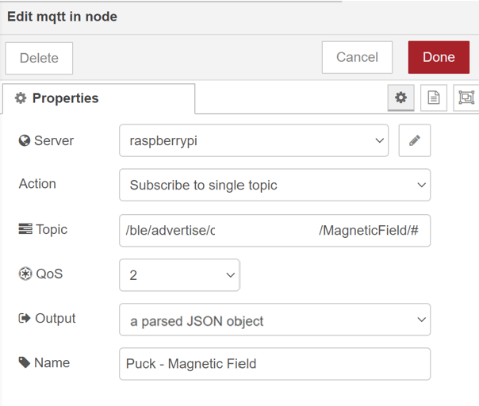
* Add a MQTT In Node that listens for the movement data
    * 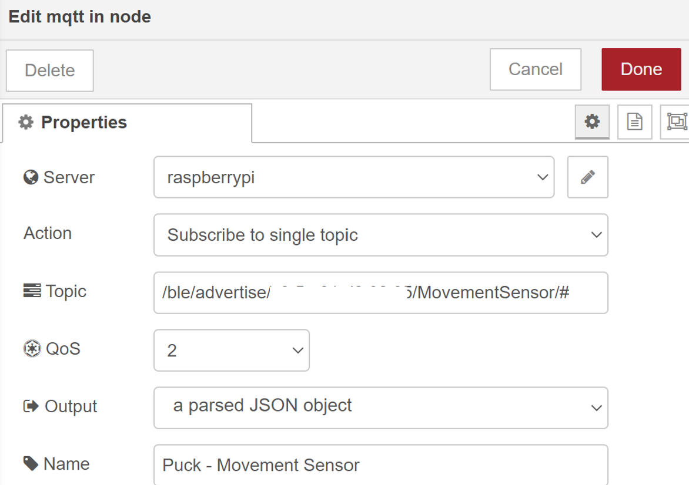

* Add a function node that processes the button message payload
    * 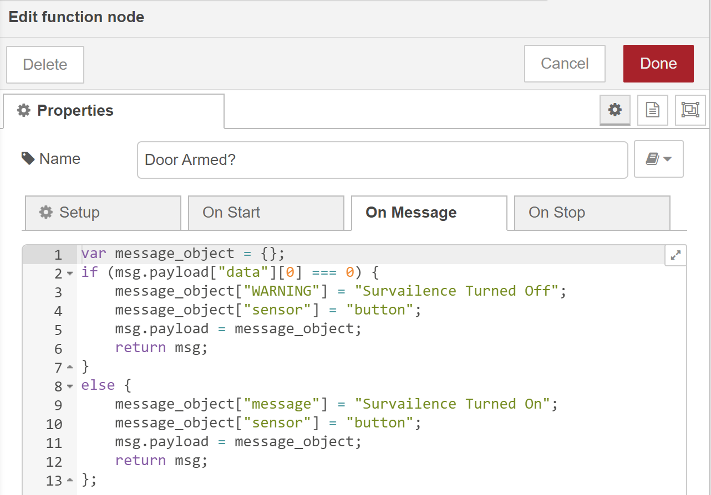

```
var message_object = {};
if (msg.payload["data"][0] === 0) {    
    message_object["WARNING"] = "Survailence Turned Off";
    message_object["sensor"] = "button";
    msg.payload = message_object;
    return msg;
}
else {
    message_object["message"] = "Survailence Turned On";
    message_object["sensor"] = "button";
    msg.payload = message_object;
    return msg;
};
```

* Add a function node that processes the magnetic field message payload
    * 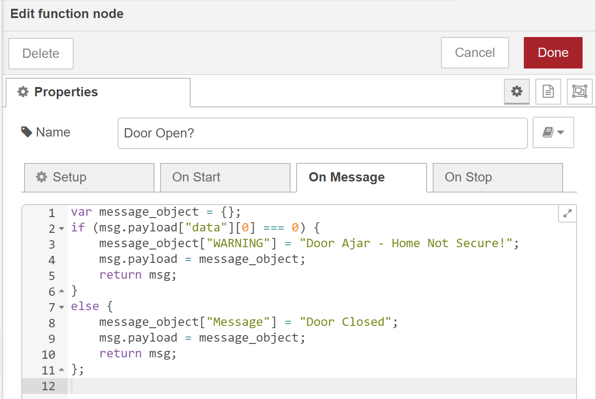

```
var message_object = {};
if (msg.payload["data"][0] === 0) {    
    message_object["WARNING"] = "Door Ajar - Home Not Secure!";
    msg.payload = message_object;
    return msg;
}
else {
    message_object["Message"] = "Door Closed";
    msg.payload = message_object;
    return msg;
};

```

* Add a function node that processes the movement message payload
    * 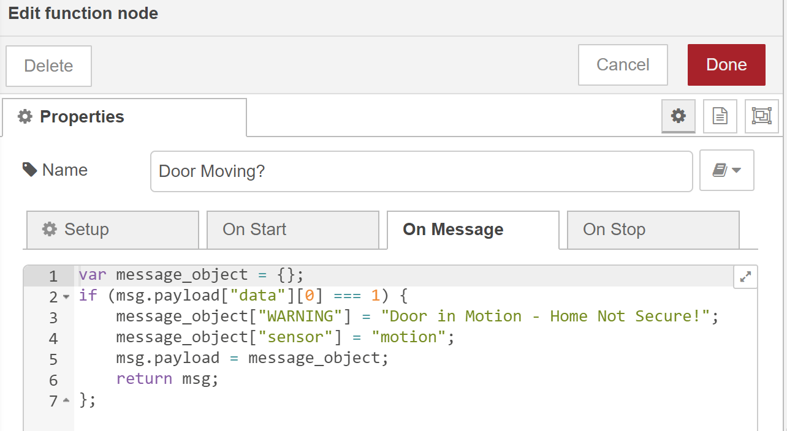

```
var message_object = {};
if (msg.payload["data"][0] === 1) {    
    message_object["WARNING"] = "Door in Motion - Home Not Secure!";
    message_object["sensor"] = "motion";
    msg.payload = message_object;
    return msg;
};
```

* Add a MQTT out node that publishes to your AWS pub/sub iot core
    * 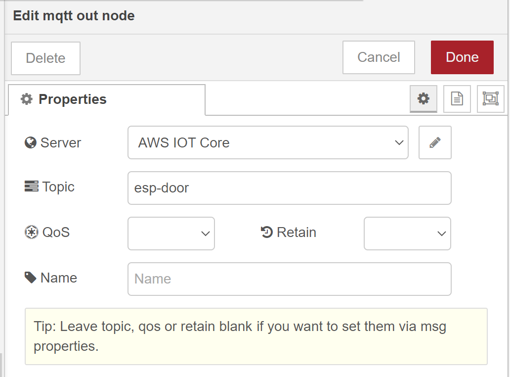


Test!
--------
* Tip: Please reatert the puck.js by taking the battery out and putting it bakc in. As long as the code was flashed to the puck it'll start advertising immediately
* Put a Magnet near your door frame and the Puck right next to it.
    * [[https://youtube.com/shorts/Ejb9RpYWCKc?feature=share]]
* Test the features by opening/closing your door, and pressing the button. You'll get emails from AWS about door movement, door open/closed/ and alarm on/off.
    * 

Buying
------
[Puck.js](/Puck.js) devices can be [ordered from here](/Order#puckjs)
